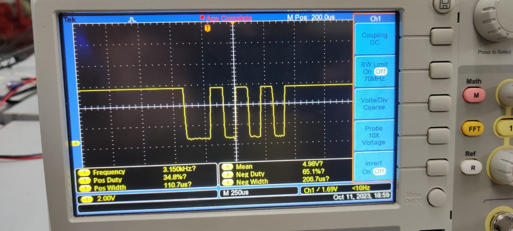
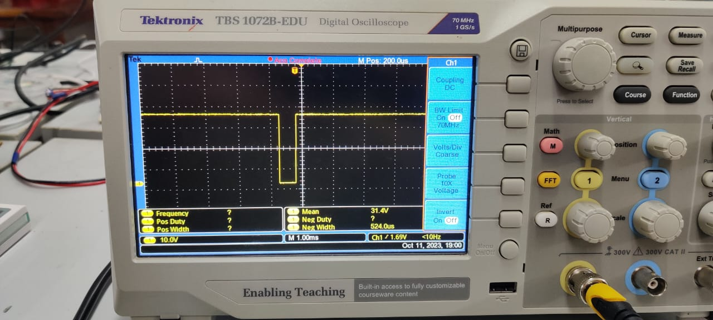

# Embedded Systems Lab Report

<!-- Insert your details here -->
* Kaushik Powar [ee23mt011@iitdh.ac.in] 
* Dixshant Jha [ee23mt025@iitdh.ac.in]
* Group: 01  
* [02/10/2023]

### Problem Statement:

Transmit and Receive data using UART modules in TM4C123GH6PM

### Procedure:

#### Task : 
##### Program your microontroller to transmit:

"F0" if SW1 is pressed

"AA" if SW2 is pressed 

over UART with baud rate 9600 and odd parity. 

Your program should also listen for incoming data on the UART with the same baud and parity config; if "AA" is received LED should be GREEN; if "F0" is recieved, the LED should be BLUE and if any error is detected LED should be RED. Test this by communicating with your neighboring group.

1. Initalize and Configure, the Digital functions and Interrupts, on GPIOF
2. Enable UART7 module using RCGCUART register
3. Give clock to Port E, for pins PE0 and PE1(U7Rx and U7Tx).
4. Select the alternate fucntions for PE0 and PE1, using AFSEL and PCTL registers.
5. Load the appropriate values in UARTFBRD and UARTIBRD registers.
6. Configure the UARTLCRH and UARTCC registers accordingly.
7. Configure the Receive interrupts on UART7 module.

### Measurements:

BRD = 16000000/(16*9600) = 104.16667
UARTIBRD =104
UARTFBRD = integer value of  0.16666*64 + 0.5 = 11.

### Results:

*transmitted hexadecinal data AA on UART7*

*transmitted hexadecinal data F0 on UART7*

tramsitted data on oscilloscope
 
